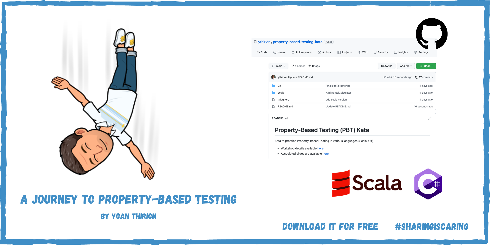

# Property-Based Testing (PBT) Kata
Kata to practice Property-Based Testing in various languages (Scala, C#)

* Workshop details available [here](https://yoan-thirion.gitbook.io/knowledge-base/software-craftsmanship/code-katas/improve-your-software-quality-with-property-based-testing/a-journey-to-property-based-testing)
* Associated slides are available [here](https://speakerdeck.com/thirion/a-journey-to-property-based-testing)

